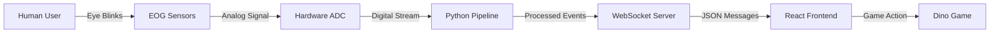
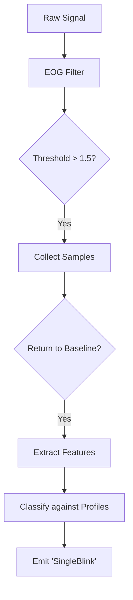
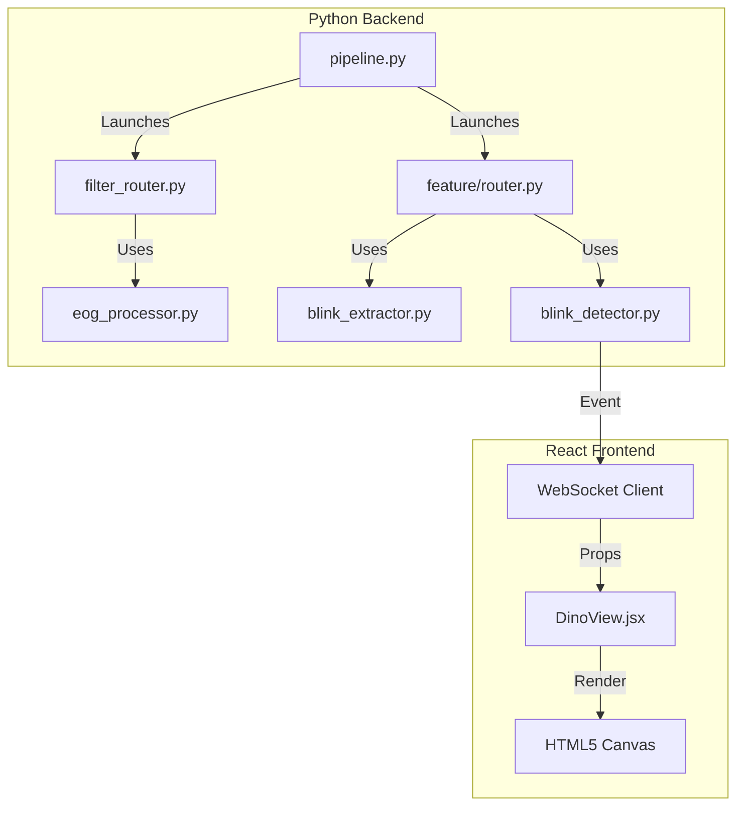

<div align="center">

# Project Documentation

## Brain-To-Brain Telepathic Communication System
### (EOG Sensor & Dino Game Integration)

<br/><br/><br/>

### Submitted By:
**Name:** Anjali Thakur  
**Semester:** 5th Sem CSE  
**Institute:** Adina Institute of Science and Technology

<br/><br/><br/>

  
*(Representation of Brain-Computer Interface)*

</div>

<div style="page-break-after: always;"></div>

# Table of Contents
1. [Abstract](#abstract)
2. [Introduction](#introduction)
3. [System Architecture](#system-architecture)
4. [EOG Sensor Technology](#eog-sensor-technology)
5. [Signal Processing Pipeline](#signal-processing-pipeline)
6. [Blink Detection Logic](#blink-detection-logic)
7. [Dino Game Integration](#dino-game-integration)
8. [Workflow & Data Flow](#workflow--data-flow)
9. [Codebase Analysis](#codebase-analysis)
10. [Advantages & Future Scope](#advantages--future-scope)
11. [Conclusion](#conclusion)

---

# 1. Abstract
The "Brain-To-Brain Telepathic Communication System" is a cutting-edge Brain-Computer Interface (BCI) project designed to translate human biosignals into digital commands. This documentation specifically focuses on the integration of **Electrooculography (EOG)** sensors with a custom-built **Dino Game**. By detecting specific eye movements—specifically blinks—users can control the game character (Dino) hands-free. A single blink triggers a "Jump" action, while a double blink can toggles "Pause/Resume". This system demonstrates the practical application of neuro-technology in assistive devices and gaming.

# 2. Introduction
In standard computing application, users rely on physical peripherals like keyboards and mice to interact with software. However, for individuals with motor disabilities or for immersive "hands-free" experiences, alternative input methods are required. 

This project implements a complete BCI pipeline that:
1. Acquires raw EOG signals from electrodes placed near the eyes.
2. Filters and processes these signals in real-time using Python.
3. Detects specific patterns (Blinks) using statistical feature extraction.
4. Transmits these events via WebSockets to a React-based frontend.
5. Executes game logic in the Dino Game, allowing the user to play by simply blinking.

# 3. System Architecture
The system follows a modular pipeline architecture, ensuring efficient data processing and separation of concerns.

## 3.1 High-Level Diagram


## 3.2 Core Components
- **Hardware Layer**: Bio-amplifiers and electrodes capture micro-voltage potential changes from eye movements (EOG).
- **Processing Layer (Python)**: The `pipeline.py` script orchestrates data ingestion. Specific modules (`eog_processor.py`, `blink_extractor.py`) clean the signal and extract meaninful features.
- **Application Layer (React)**: A modern web interface renders real-time data and the Dino game (`DinoView.jsx`), reacting instantly to backend events.

<div style="page-break-after: always;"></div>

# 4. EOG Sensor Technology

## 4.1 What is EOG?
**Electrooculography (EOG)** is a technique for measuring the corneo-retinal standing potential that exists between the front and the back of the human eye. The eye acts as a dipole: the cornea is positively charged, and the retina is negatively charged.

- **Movement Tracking**: When the eye moves, the dipole moves. This creates a measurable potential difference between electrodes placed on the skin.
- **Blink Detection**: A blink creates a massive, rapid vertical spike in the EOG signal due to the eyelid sliding over the cornea (the Bell phenomenon) and the vertical movement of the eyeball itself.

## 4.2 Sensor Placement
To detect blinks effectively, electrodes are typically placed:
- **Above the Eye (Supraorbital)**
- **Below the Eye (Infraorbital)**
- **Reference (Mastoid/Ear)**

This vertical arrangement captures the strong vertical potential change associated with blinking.

# 5. Signal Processing Pipeline

Raw biosignals are notoriously noisy. Before we can detect a blink, we must clean the signal. The file `src/processing/eog_processor.py` handles this.

## 5.1 Filters Applied
The `EOGFilterProcessor` class applies a cascade of digital filters:

1.  **Low-Pass Filter (Cutoff ~10Hz)**:
    -   *Purpose*: Removes high-frequency muscle noise (EMG) and electrical interference. EOG signals are generally slow (< 10Hz).
    -   *Implementation*: 4th order Butterworth filter.

2.  **Notch Filter (50Hz or 60Hz)**:
    -   *Purpose*: Removes power line hum (mains interference).
    -   *Implementation*: IIR Notch filter.

3.  **Band-Pass Filter (0.5Hz - 10Hz)**:
    -   *Purpose*: Isolates the specific frequency band of eye movements, removing DC drift (sweat artifacts) and high-frequency noise.

### Code Snippet: Filter Design
```python
# From src/processing/eog_processor.py
def _design_filters(self):
    nyq = self.sr / 2.0
    # Low Pass Design
    wn = self.lp_cutoff / nyq
    self.b_lp, self.a_lp = butter(self.lp_order, wn, btype="low")
```

<div style="page-break-after: always;"></div>

# 6. Blink Detection Logic

Once filtered, the signal is analyzed for "events". This happens in two stages: **Extraction** and **Detection**.

## 6.1 Feature Extraction (`blink_extractor.py`)
The `BlinkExtractor` monitors the signal stream in real-time. It uses a **sliding window** approach.

1.  **Baseline Estimation**: Continually calculates the "resting potential" of the eye to adapt to slow drifts.
2.  **Threshold Trigger**: When the signal amplitude (relative to baseline) exceeds a configured threshold (e.g., `1.5` units), it starts recording a "Candidate Window".
3.  **Window Closure**: 
    -   If the signal returns to baseline, the window is closed.
    -   If the window duration is too long (> 500ms) or too short (< 100ms), it is discarded.
4.  **Feature Calculation**: For valid windows, statistical features are computed:
    -   `amplitude`: Peak height.
    -   `duration_ms`: Total time of the spike.
    -   `asymmetry`: Ratio of rise time to fall time (blinks are often sharp rises with slower falls).

## 6.2 Event Classification (`blink_detector.py`)
The `BlinkDetector` receives the features dict and classifies it against pre-defined profiles (e.g., "SingleBlink", "DoubleBlink").

-   **Profile Matching**: It checks if the extracted features fall within specific ranges.
    -   *Example Profile*: `Amplitude [2.0 - 5.0]`, `Duration [150ms - 300ms]`.
-   **Decision**: If all criteria match, a labeled event (e.g., `"SingleBlink"`) is emitted.

### Detection Flow Diagram


<div style="page-break-after: always;"></div>

# 7. Dino Game Integration

The frontend, built with **React**, renders the game. The core logic resides in `frontend/src/components/views/DinoView.jsx`.

## 7.1 Game Physics & Mechanics
The game is a custom implementation using HTML5 Canvas (`<canvas>`).
-   **Gravity**: A constant downward force (`GRAVITY = 0.4`) applied to the Dino every frame.
-   **Velocity**: The Dino has a vertical velocity (`velocityRef`).
-   **Jump Logic**: When a jump occurs, the velocity is instantly set to a negative value (`JUMP_STRENGTH = -10`), launching the Dino upwards against gravity.

## 7.2 Connecting Signals to Game Actions
The `DinoView` component listens for WebSocket messages from the Python backend.

1.  **WebSocket Listener**: The `wsEvent` prop carries the latest event.
2.  **Event Handling**:
    ```javascript
    // Inside DinoView.jsx
    useEffect(() => {
        if (!wsEvent) return;
        if (wsEvent.event === 'SingleBlink') {
            handleSinglePress(); // Triggers Jump
        }
    }, [wsEvent]);
    ```
3.  **Execution**: `handleSinglePress()` sets the game state to `playing` (if ready) or applies the jump velocity (if already playing).

## 7.3 Visual Feedback
To confirm the signal was received, the UI displays visual indicators:
-   **Eye Icons**: On-screen eyes blink in sync with the user (`triggerSingleBlink()`).
-   **Event Log**: A scrolling text log shows "Single Blink Recv" or "Jump Triggered".

# 8. Workflow & Data Flow

This section details the complete journey of a single piece of data from the User's eye to the Dino's jump.

## 8.1 Detailed Data Flow
1.  **User Blinks**: Eye potential spikes by ~300µV.
2.  **Acquisition**: Hardware amplifies signal -> sent to PC via Bluetooth/USB -> LSL Stream.
3.  **Filter Router**: `pipeline.py` starts `filter_router.py`. It picks up the LSL stream, applies `EOGFilterProcessor` logic, and pushes to a "Processed" stream.
4.  **Feature Router**: `feature/router.py` picks up the "Processed" stream.
    -   Feeds data to `BlinkExtractor`.
    -   Extractor detects spike -> sends feature dict to `BlinkDetector`.
    -   Detector identifies "SingleBlink".
    -   Router publishes JSON event: `{"event": "SingleBlink", "timestamp": ...}` via WebSocket.
5.  **Frontend**: Browser receives JSON. `DinoView` sees "SingleBlink".
6.  **Action**: `velocityRef.current` becomes `-10`. Dino jumps over cactus.

## 8.2 File Connection Diagram


<div style="page-break-after: always;"></div>

# 9. Codebase Analysis

## 9.1 `src/processing/eog_processor.py`
This file is the "Signal Cleaner".
-   **Key Class**: `EOGFilterProcessor`.
-   **Important Method**: `process_sample(val)`. It maintains the state of the digital filters (`zi_lp`, `zi_notch`) to allow sample-by-sample real-time filtering without lag or phase distortion artifacts common in block processing.

## 9.2 `src/feature/extractors/blink_extractor.py`
This file is the "Pattern Finder".
-   **Key Class**: `BlinkExtractor`.
-   **Important Logic**: The `process()` method implements a state machine (`is_collecting` boolean). It waits for the signal to cross `amp_threshold`. This is efficient and robust against random noise that doesn't sustain amplitude.

## 9.3 `src/feature/detectors/blink_detector.py`
This file is the "Decision Maker".
-   **Key Class**: `BlinkDetector`.
-   **Important Logic**: It decouples the "shape" of the signal from the "meaning". The extractor finds *shapes* (spikes), but the detector decides if that shape is a *Blink*, *Look Left*, or *Look Right* based on the `config` profile. This allows easy tuning without changing code.

## 9.4 `frontend/src/components/views/DinoView.jsx`
This file is the "Game Engine".
-   **Key Component**: `DinoView`.
-   **Important Logic**:
    -   `useEffect` hooks manage the game loop (`requestAnimationFrame` implicitly via state or timers).
    -   `drawDino()`: Renders the pixel-art dinosaur.
    -   `handleSinglePress()`: The bridge between the "Signal" world and the "Game" world.

# 10. Advantages & Future Scope

## 10.1 Advantages
1.  **Hands-Free Interaction**: Crucial for users with paralysis (ALS, Locked-in Syndrome) who retain eye movement control.
2.  **Low Latency**: The dedicated processing pipeline ensures the "blink-to-jump" delay is minimal (< 50ms processing time), making it viable for fast-paced games.
3.  **Cost Effective**: Uses standard webcam or low-cost EOG electrodes compared to expensive EEG caps.
4.  **Non-Invasive**: Surface electrodes are safe and easy to apply.

## 10.2 Future Scope
1.  **Multi-Directional Control**: Extending the logic to detect "Look Left" and "Look Right" for 2D movement games (e.g., Snake).
2.  **Machine Learning Integration**: Replacing threshold-based detection with a trained Neural Network (CNN/RNN) to distinguish subtle eye gestures or filter artifacts more reliably.
3.  **Medical Diagnostics**: Using the same system to analyze blink rates and saccades for fatigue detection or neurological diagnosis.
4.  **Telepathic Communication**: encoding Morse code via blinks to allow silent text communication between two users (Brain-to-Brain).

# 11. Conclusion
The "Brain-To-Brain Telepathic Communication System" successfully demonstrates the convergence of Neuroscience and Computer Science. By robustly integrating EOG signal processing with a responsive frontend game, we have created a functional prototype of assistive technology. This project lays a strong foundation for more advanced BCI applications, proving that the human eye can serve as a precise and rapid controller for digital interfaces.

---
*Document Generated for Academic Submission | 2025*
